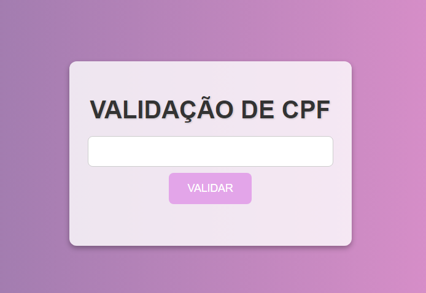
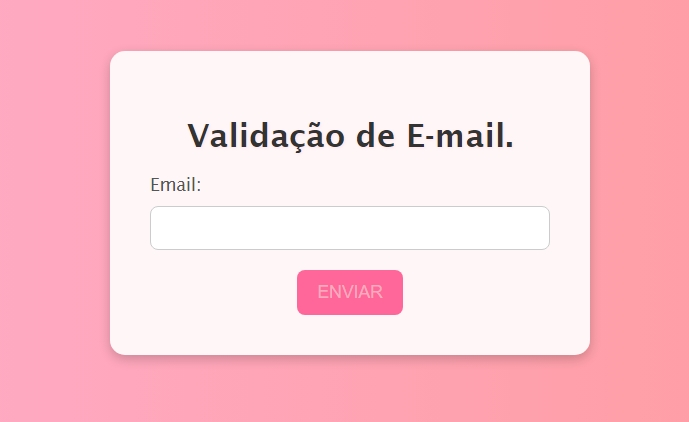

# VALIDAÇÃO DE CPF

Este projeto é uma aplicação web simples para a validação de números de CPF (Cadastro de Pessoas Físicas) usando HTML, CSS e JavaScript. O objetivo é verificar se o CPF inserido pelo usuário é válido conforme as regras de validação oficiais.

## Estrutura do Projeto

### 1. HTML

O arquivo HTML define a estrutura básica da página, incluindo um formulário para inserção do CPF, um botão para iniciar a validação, e uma área para exibição de mensagens de resultado.

#### Principais Elementos:

- `<meta charset='utf-8'>`: Define a codificação de caracteres como UTF-8.
- `<meta name='viewport' content='width=device-width, initial-scale=1'>`: Faz a página ser responsiva.
- `<link rel='stylesheet' type='text/css' media='screen' href='cpf.css'>`: Linka o arquivo de estilo CSS para a página.
- `<form action="" id="cpfForm">`: Formulário onde o CPF é inserido.
- `<input type="text" id="cpf" name="cpf" maxlength="14">`: Campo de entrada para o CPF, com um limite de 14 caracteres (incluindo pontos e traço).
- `<button type="submit">VALIDAR</button>`: Botão para submeter o formulário.
- `

`: Elemento para exibir a mensagem de validação (CPF válido ou inválido).

### 2. CSS

O CSS fornecido estiliza uma página de validação de CPF com uma interface moderna e atraente. Aqui está uma breve explicação dos principais estilos aplicados:

Esses estilos combinam para criar uma interface limpa, amigável e visualmente atraente, com foco em acessibilidade e responsividade.

### 3. JavaScript

O arquivo `cpf.js` contém a lógica de validação do CPF.

#### Funções e Lógica:

  Este código previne o comportamento padrão de envio do formulário e chama a função `validarCPF` para verificar se o CPF é válido. A mensagem é exibida na cor verde se for válido e vermelho se for inválido.

- **Função `validarCPF`:**
 
  A função `validarCPF` realiza a validação do CPF seguindo as regras do algoritmo oficial. O CPF é validado em duas etapas:
  1. **Primeiro Dígito Verificador**: Calcula-se o primeiro dígito verificador e o compara com o dígito correspondente no CPF.
  2. **Segundo Dígito Verificador**: O segundo dígito verificador é então calculado e comparado com o segundo dígito verificador do CPF.

Se ambas as validações estiverem corretas, o CPF é considerado válido.

## Como Executar

1. **Clone o Repositório:** Clone este repositório em seu ambiente local.
2. **Abra o Arquivo HTML:** Abra o arquivo HTML em um navegador web.
3. **Insira o CPF:** Insira um número de CPF no campo designado e clique no botão "VALIDAR".
4. **Verifique o Resultado:** A mensagem de validação será exibida na tela.

# VALIDAÇAO DE EMAIL

Este projeto é uma aplicação web simples para a validação de endereços de e-mail usando HTML, CSS e JavaScript. A aplicação permite que os usuários insiram um e-mail e verifica se o formato do e-mail é válido antes de permitir o envio do formulário.

## Estrutura do Projeto

### 1. HTML

O arquivo HTML define a estrutura da página, incluindo um formulário para inserção do e-mail, um botão de envio, e uma área para exibição de mensagens.

#### Principais Elementos:

- **`<meta charset='utf-8'>`**: Define a codificação de caracteres como UTF-8.
- **`<meta http-equiv='X-UA-Compatible' content='IE=edge'>`**: Garante a compatibilidade com versões antigas do Internet Explorer.
- **`<meta name='viewport' content='width=device-width, initial-scale=1'>`**: Faz a página ser responsiva, ajustando-se ao tamanho da tela.
- **`<link rel='stylesheet' type='text/css' media='screen' href='email.css'>`**: Inclui o arquivo CSS para estilização da página.
- **`<form action="" class="form" name="frmEnvia" onsubmit="return (verifica())">`**: Formulário que contém o campo de entrada de e-mail e o botão de envio, com a função `verifica()` chamada ao submeter.
- **`<input type="text" name="email" id="email" onblur="checarEmail()">`**: Campo de entrada para o e-mail, com a função `checarEmail()` chamada ao perder o foco.
- **`<input type="submit" id="button" value="ENVIAR">`**: Botão de envio do formulário.

### 2. CSS

Este CSS estiliza uma página de validação de e-mail, proporcionando uma interface visual atraente e moderna. Aqui estão os principais aspectos:

Esses estilos combinam para criar uma interface estética e interativa, melhorando a experiência do usuário.

### 3. JavaScript

O arquivo `email.js` contém a lógica de validação de e-mail.

#### Funções e Lógica:

- **Função `checarEmail`**:
 
  Esta função verifica se o campo de e-mail está vazio ou se falta o símbolo `@` ou o ponto `.`. Se o e-mail for inválido, uma mensagem de alerta é exibida. Caso contrário, o e-mail é exibido na página.

- **Função `verifica`**:
 
  Esta função é chamada ao enviar o formulário. Ela verifica se o campo de e-mail está vazio. Se estiver, exibe uma mensagem de alerta e foca no campo de e-mail.

## Como Executar

1. **Clone o Repositório:** Clone este repositório em seu ambiente local.
2. **Abra o Arquivo HTML:** Abra o arquivo HTML em um navegador web.
3. **Insira o E-mail:** Insira um endereço de e-mail no campo designado e clique no botão "ENVIAR".
4. **Verifique o Resultado:** A aplicação exibirá uma mensagem indicando se o e-mail é válido ou inválido.

## Fontes Ultizadas 

* [Mozilla](https://developer.mozilla.org/en-US/docs/Web/HTML/Element/form)- The Form Element.

* [Alura](https://www.alura.com.br/artigos/escrever-bom-readme)- Como Escrever um README Incrível no seu GitHub.
 
 ## Autores 👩‍💻
 | [  Ana Beatriz Silva.](https://github.com/biasantorii) |
| :---:

